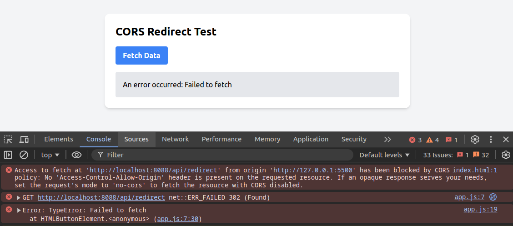
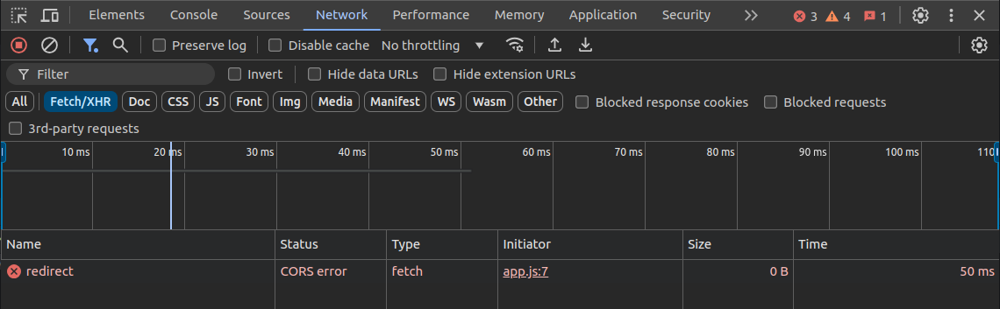
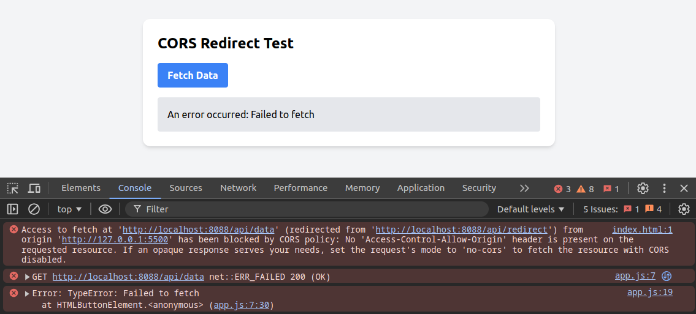
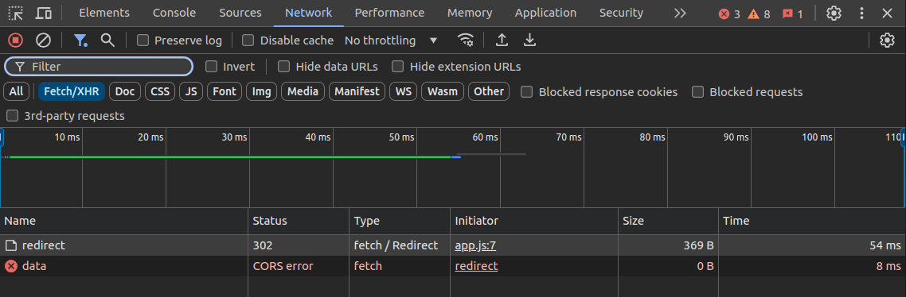
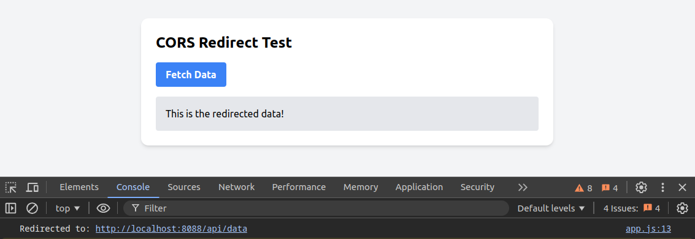
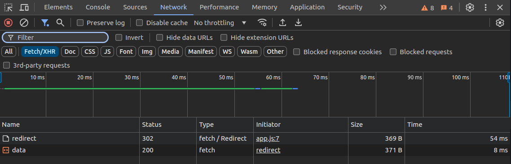

# Example with JavaScript Frontend and Spring Boot Backend to illustrate CORS Redirect issues

## To Run and Test This Example  

1. Run the Spring Boot application (it will run on [http://localhost:8088](http://localhost:8088) by default).  
2. Run the frontend HTML on a different web server (e.g., using the **Live Server** extension in VS Code, typically running on [http://localhost:5500](http://localhost:5500)).  
3. Open a browser and access the HTML page.  
4. Click the "Fetch Data" button and observe the results.  

When you click the button, the frontend will send a request to `/api/redirect`. Spring Boot will return a `302` redirect to `/api/data`. The browser will automatically follow this redirect and receive data from `/api/data`.  

## Some Points to Note  

1. CORS has been properly configured on the backend to allow requests from the frontend domain.  
2. The browser automatically handles the redirect, so you will receive the final data without needing to explicitly handle the redirect in the frontend code.  
3. If you want to control the redirect process, you can use `redirect: 'manual'` in the `fetch()` options.  
4. To check for CORS errors when not properly configured, you can comment out the `@CrossOrigin` annotations in the backend code for each `redirect()` and `getData()` method, or comment out both methods. Then, open the Console and Network tabs in the browser to observe the errors.

---

# CORS and Browser Redirect Behavior

>
> - CORS (Cross-Origin Resource Sharing) only applies to HTTP requests made by JavaScript from the browser (e.g., using XMLHttpRequest or Fetch API).  
> - CORS does not apply to regular browser redirects, page loads, or form submissions.
>

## 1. Default Browser Behavior  

- When you make an AJAX request (using `XMLHttpRequest` or `Fetch API`) and the server returns a **302 Redirect** status code, the browser will **automatically follow the redirect** to the new URL specified in the `Location` header. You don't need to handle the redirect explicitly in your frontend code, **unless you want to control this process**.  
- Although the browser follows the redirect, **if the target domain doesn't provide the necessary CORS headers, access to the final response content may be blocked**. This happens for security reasons, preventing access to data from unauthorized sources.  

## 2. Controlling and Handling Redirects Explicitly with Frontend JavaScript Code (if needed)  

### 2.1. Default Behavior in Code  

- **With Fetch API**:
  - By default, `fetch()` will automatically follow redirects (the default value for the `redirect` option is `'follow'`).  
  - You can change this behavior by setting `redirect` to `'manual'` or `'error'`.  
  - Example:

    ```javascript  
    fetch('https://backend.example.com/api/data', { redirect: 'follow' })  
        .then(response => {  
        // The browser has followed the redirect, you receive the final response  
        });  
    ```  

- **With XMLHttpRequest**:  
  - Similarly, `XMLHttpRequest` also automatically follows redirects.  
  - You can't change this behavior in `XMLHttpRequest`; it will always automatically follow redirects.  

### 2.2. Controlling the Redirect Process  

If you need to know whether a redirect has occurred or want to control sending credentials during the redirect process, you can set `redirect` to `'manual'` in `fetch()`.  

```javascript  
fetch('https://backend.example.com/api/data', { redirect: 'manual' })  
  .then(response => {  
    if (response.type === 'opaqueredirect') {  
      // A redirect has occurred, but you can't access the redirect URL due to CORS policy  
      // You can decide on the next action based on this situation  
    } else {  
      // Handle normal response  
    }  
  });
```

### 2.3. Example of Manual Redirect Handling

```javascript
fetch('https://backend.example.com/api/data', { redirect: 'manual' })  
  .then(response => {  
    if (response.status === 302) {  
      const redirectUrl = response.headers.get('Location');  
      // Perform action with the redirect URL  
      // Example: Send a new request to the redirect URL  
      return fetch(redirectUrl, { credentials: 'include' });  
    } else {  
      return response;  
    }  
  })  
  .then(response => response.json())  
  .then(data => {  
    // Process the received data  
    console.log(data);  
  })  
  .catch(error => {  
    console.error('Error:', error);  
  });
```

## 3. Example with JavaScript Frontend and Spring Boot Backend to Illustrate CORS Issues

### Case 1: No CORS Configuration

```java
@GetMapping("/api/redirect")  
public RedirectView redirect() {  
    return new RedirectView("/api/data");  
}  

@GetMapping("/api/data")  
public String getData() {  
    return "This is the redirected data!";  
}
```

- With Direct URL Access (typing [http://localhost:8088/api/redirect](http://localhost:8088/api/redirect) in the address bar) ⇒ Always successful


> 📔 Reminder: CORS does not apply to regular browser redirects, page loads, or form submissions.

- With AJAX/Fetch ⇒ CORS Error

| Console Tab: | Network Tab: |  
|------------|------------|  
|  |  |

### Case 2: No CORS Configuration for redirect() Function

```java
@GetMapping("/api/redirect")  
public RedirectView redirect() {  
    return new RedirectView("/api/data");  
}  

@GetMapping("/api/data")  
@CrossOrigin(origins = {"http://localhost:5500", "http://127.0.0.1:5500"}, allowCredentials = "true")  
public String getData() {  
    return "This is the redirected data!";  
}  
```

- With AJAX/Fetch ⇒ CORS Error same as Case 1

> 📔 Reminder: If the target domain doesn't provide the necessary CORS headers, access to the final response content may be blocked.

Here, the first target domain is `/redirect`, so it fails immediately.

### Case 3: CORS Configuration for redirect() Function but Not for getData() Function

```java
@GetMapping("/api/redirect")  
@CrossOrigin(origins = {"http://localhost:5500", "http://127.0.0.1:5500"}, allowCredentials = "true")  
public RedirectView redirect() {  
    return new RedirectView("/api/data");  
}  

@GetMapping("/api/data")  
public String getData() {  
    return "This is the redirected data!";  
}  
```

- With AJAX/Fetch ⇒ CORS Error when calling `/data`

| Console Tab: | Network Tab: |  
|------------|------------|  
|  |  |

> 📔 Reminder: If the target domain doesn't provide the necessary CORS headers, access to the final response content may be blocked.

Here, the target domain is `/data`, so it fails.

### Case 4: Full CORS Configuration

```java
@GetMapping("/api/redirect")  
@CrossOrigin(origins = {"http://localhost:5500", "http://127.0.0.1:5500"}, allowCredentials = "true")  
public RedirectView redirect() {  
    return new RedirectView("/api/data");  
}  

@GetMapping("/api/data")  
@CrossOrigin(origins = {"http://localhost:5500", "http://127.0.0.1:5500"}, allowCredentials = "true")  
public String getData() {  
    return "This is the redirected data!";  
} 
```

- With Direct URL Access (typing [http://localhost:8088/api/redirect](http://localhost:8088/api/redirect) in the address bar) ⇒ Still always successful
- With AJAX/Fetch ⇒ Successful

| Console Tab: | Network Tab: |  
|------------|------------|  
|  |  |
